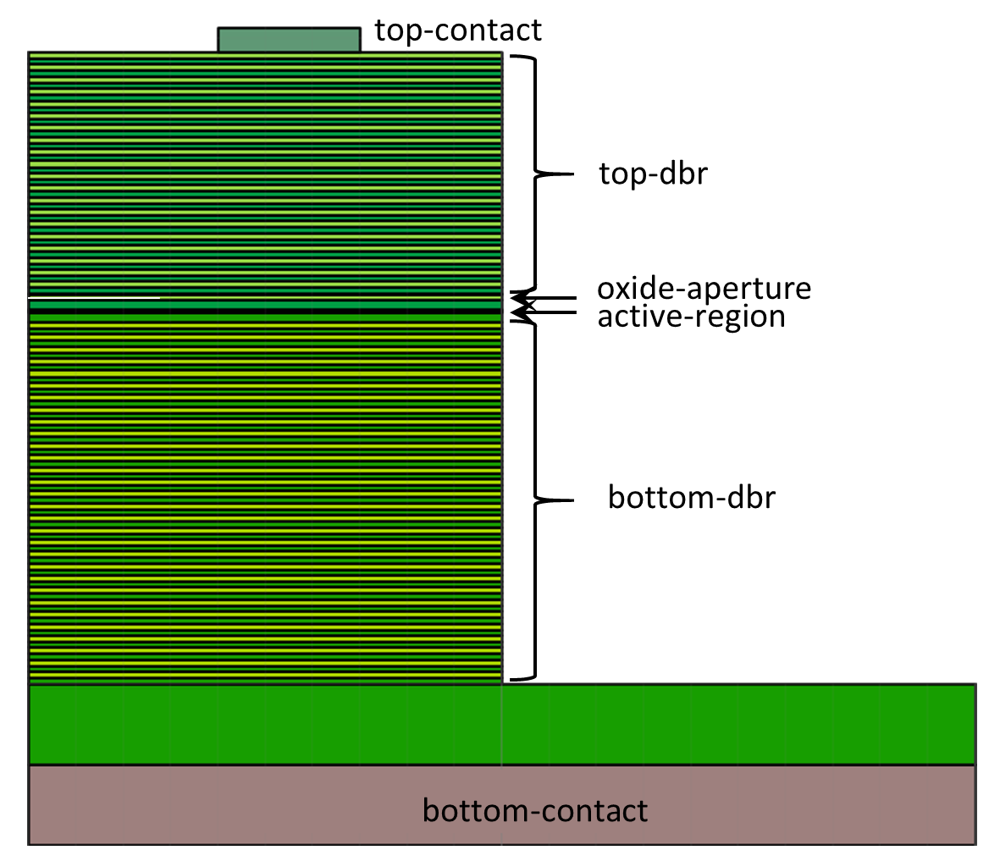

.. _sec-geometry:

**********************
Geometry Specification
**********************

.. _sec-geometry-xpl:

The whole definition of the structure's geometry is based on the geometry tree. Every physical object is defined as a leaf of this tree. Below is a simple example of VCSEL cylindrical two-dimensional geometry definition in the xpl script form:

.. code-block:: xml

 <cylindrical2d name="main" axes="r,z">
  <!-- This is comment not visible by the solver -->

  <stack> 
  <!-- "<stack>" places physical objects one on the other; a whole geometry of 
  the laser must be defined as a stack -->

   <shelf>
	<gap total="7"/>
	<block dr="3" dz="0.3" name="top-contact" material="AuGe" /> 
	<!-- This is physical object (here, in a 2D cylindrical geometry: 
	a disc or ring) of 3um radius and 0.3um height -->
   </shelf> <!-- This describes the end of the shelf definition -->

   <!-- To make a contact on a side of the structure one have to use the 
   "<shelf>" which presents the physical objects placed one beside the other 
   like books on a shelf. "<gap>" fills the missing places with air -->
	
   <stack name="top-dbr" repeat="20"> 
   <!-- "repeat" defines the repetitions of stacks -->
	<block dr="10" dz="0.0795" material="Al(0.73)GaAs:Si=2e+18"/> 
	<!-- A lot of materials are defined in the database of the PLaSK, 
	here "0.73" defines the fraction of the aluminium in AlGaAs and 
	"Si=2e+18" defines the dopant and doping level of this material -->
	<block dr="10" dz="0.07" material="GaAs:Si=2e+18"/>
   </stack>

   <shelf name="oxide-aperture">
	<block dr="3" dz="0.0160" name="aperture" material="AlAs:Si=2e+18"/>
	<block dr="7" dz="0.0160" name="oxide" material="AlOx"/>
   </shelf>
  
   <block dr="10" dz="0.0635" material="Al(0.73)GaAs:Si=2e+18"/>
   <block dr="10" dz="0.1160" material="GaAs:Si=5e+17"/>
  
   <stack name="active-region" role="active"> 
   <!-- "role="active"" is here necessary for the solver to know where 
   the active region is; "role="QW"" below is necessary as well-->
	<stack repeat="4">
	 <block dr="10" dz="0.0060" material="GaAs" name="barrier"/>
	 <block dr="10" dz="0.0040" name="QW" role="QW" material="InGaAsQW"/>
	</stack>
	<again ref="barrier"/> 
	<!-- This command is used to refer and to place the geometry 
	object "barrier" which was defined earlier in the script-->
   </stack>

   <block dr="10" dz="0.1160" material="GaAs:C=5e+17"/>

   <stack name="bottom-DBR" repeat="30">
	<block dr="10" dz="0.0795" material="Al(0.73)GaAs:C=2e+18"/>
	<block dr="10" dz="0.0700" material="GaAs:C=2e+18" />
   </stack>

   <zero/> 
   <!-- This command defines the vertical zero position; 
   all objects above are z>=0 and below z<0 -->

   <block material="GaAs:C=2e+18" dr="20." dz="1."/> 
   <!-- This substrate is thin only for clear presentation reasons, 
   same as a copper heat sink below -->
   <block name="bottom-contact" material="Cu" dr="20." dz="1."/> 
   <!-- Names for contacts are necessary for future reference -->
  </stack>
 </cylindrical2d> <!-- The end of this geometry definition -->

This geometry defines such a structure:

| Defining a geometry first one have to define its type. There are three possibilities: a two-dimensional Cartesian geometry, a two-dimensional cylindrical geometry or a three-dimensional Cartesian geometry. For attributes of these geometries see section :ref:`sec-xpl-geometry-types`. **Name** is obligatory for further reference. More than one geometry can be specified.

Into newly defined geometry various items can be included:

1. **containers** are branches of the tree which include leafs. I.e. containers are boxes in which physical objects are placed. Containers are:

	* *align*
	
	* *shelf* (only in 2d geometry) 
	
	* *stack*
	
For their attributes see section :ref:`sec-xpl-geometry-2d-containers` or :ref:`sec-xpl-geometry-3d-containers`.

2. **transforms** - transforms always contain a single geometry object (possibly a container) as their content and perform some transformation of this object. Transforms are: 
	
	* *arrange*
	
	* *clip*
	
	* *flip*
	
	* *intersection*
	
	* *mirror*
	
	* *translation*
	
	* *extrusion* (only in 3d geometry)
	
	* *lattice* (only in 3d geometry)
	
	* *revolution* (only in 3d geometry)
	
For their attributes see section :ref:`sec-xpl-geometry-2d-transforms` or :ref:`sec-xpl-geometry-3d-transforms`.

3. **physical objects** which are the leafs of the whole geometry tree. Physical geometry objects are representing actual objects having defined shape, dimensions and material. One can define following physical objects for **two-dimensional** geometry:

..

	* Rectangular **block**. Its origin is located at the lower left corner.

	* **Triangle** with one vertex at point (0, 0).

	* **Circle** with centre at point (0, 0).
	
  or these for **three-dimensional** geometry:

	* Rectangular **block**. Its origin is located at the lower back left corner. 

	* **Cylinder** with its base lying in the horizontal plane. Its origin is located at the center of the lower circular base.  

	* **Sphere** with centre at point (0, 0, 0).

For their attributes see section :ref:`sec-xpl-geometry-2d-objects` or :ref:`sec-xpl-geometry-3d-objects`.

Each geometry object can have an optional name for further reference in computational script or further in geometry specification. Each geometry object can therefore be copied - see section :ref:`sec-xpl-Geometry-objects-copy-ref`.  

Specifying geometry in XPL file
===============================

See :ref:`sec-xpl-geometry`.

Creating Geometry from Python
=============================

.. _sec-geometry-python:

See section :mod:`plask.geometry`.

Reference of Geometry Objects
=============================

See sections :ref:`sec-xpl-geometry` and :mod:`plask.geometry`.
