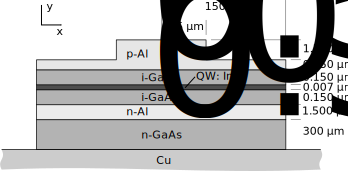

.. _sec-Thermo-electrical-modeling-of-simple-ee-laser:

Thermo-electrical modeling of simple edge-emitting diode
--------------------------------------------------------

This tutorial presents basic usage of PLaSK. It shows how to define the basic geometry and how to perform computations using solvers. During the tutorial creation of all parts of the input file is described step-by-step, together with the discussion of it meaning. Before starting following the instructions described here, please make sure that PLaSK is installed correctly and create a separate working directory. We assume that you are able to launch the main binary as described in section :ref:`sec-Running-PLaSK`. In order to begin, you need to open your favorite text editor and create a file named :file:`tutorial1.xpl`. Save it (an empty file at the moment) in the directory you have just created.

In general, PLaSK uses :term:`XML` as a format of its input files. By default they have standard extension ``.xpl`` (which you may consider as a shortcut from "**X**\ ML in **PL**\ aSK"). They contain definition of custom materials, analyzed structure geometry, configuration of the computational solvers and a Python script defining the step-by-step operations to perform during computations. However, it is a common situation that these operations remain the same for a large number of different analyzed devices. Hence, it is possible to save them in a separate file with an extension ``.py`` that is just a Python script and use the :term:`XPL` only for definition of the structure [#run-py-file]_. We will demonstrate such option in the next tutorial in section :ref:`sec-Optical-analysis-of-VCSEL`.

After :term:`reading a very brief introduction to XML syntax <XML>`, you start writing your first PLaSK input file. First you have to define the main tag ``<plask>``. Everything you write will be the content of this tag:

.. code-block:: xml

    <plask>
    
        <!-- Here you will put all the content of your file. -->
    
    </plask>

The strange characters ``<!--`` and ``-->`` in the above example mark the beginning and the end of the comment, respectively. So you can use them in your file to write your notes, or to temporarily disable any part of the file.

Inside the main tag you may define the following sections: ``materials``, ``geometry``, ``grids``, ``solvers``, ``connects``, and ``script``. All these sections are optional, however, if present, they must follow in the order specified above. You will learn the roles of these sections in this and the following tutorials. In details, they are described further in this manual.

    
Geometry
^^^^^^^^

.. _fig-tutorial1-geometry:

   Simple edge-emitting gallium-arsenide diode modeled in :file:`tutorial1.xpl` file.

In this tutorial we start with the geometry section. It describes the geometry of the structure. We want to define a simple gallium arsenide edge-emitting diode, presented in Figure :ref:`Simple edge-emitting gallium-arsenide diode <fig-tutorial1-geometry>`. It can be modeled as a two-dimensional Cartesian structure, hence, we begin by specifying the geometry section and Cartesian two-dimensional geometry type:

.. code-block:: xml

	<plask>

	<geometry>
	  <cartesian2d axes="xy" left="mirror" length="1000" name="main">
	    <!-- Here we put the geometry definition. -->
	  </cartesian2d>
	</geometry>

	</plask>

The ``axes`` attribute of means that we will use the *xy* axes in our geometry definition i.e. *x* is the name of the horizontal axis and *y* of the vertical one. As the structure has mirror symmetry in the *x*-direction, it is sufficient to model only half of it and the left edge of the computational domain is the mirror, which is indicated by the ``left="mirror"`` attribute. The length of the chip in the third *z* direction is set to 1 mm (``length="1000"``, where the value is specified in microns as all geometrical dimensions in PLaSK). The last attribute ``name`` simply gives the geometry name (``"main"``) for later reference.

Due to the nature of the structure, it is the most natural to describe it as a stack of layers. Each layer is shifted to the left side of the stack (i.e. to the symmetry plane), which is a default. Hence, the structure definition will be (from now on we will skip ``<plask>…</plask>`` main tag from listings, although you must remember to keep them in your file):

.. code-block:: xml

	<geometry>
	  <cartesian2d axes="xy" left="mirror" length="1000" name="main">
	    <stack>
	      <block dx="1.5" dy="1.350" material="Al(0.3)GaAs:C=1e20 name="top-layer""/>
	      <block dx="150" dy="0.150" material="Al(0.3)GaAs:C=1e20"/>
	      <block dx="150" dy="0.150" material="GaAs"/>
	      <block dx="150" dy="0.007" material="In(0.2)GaAs" role="active" name="junction"/>
	      <block dx="150" dy="0.150" material="GaAs"/>
	      <block dx="150" dy="1.500" material="Al(0.3)GaAs:Si=5e19"/>
	      <block dx="150" dy="300" material="GaAs:Si=5e19" name="substrate"/>
	      <zero/>
	      <block dx="1000" dy="1000" material="Cu"/>
	    </stack>
	  </cartesian2d>
	</geometry>

In the above listing, two new tags appeared. One is ``<stack>`` and means that its whole content should be organized in the vertical :ref:`stack <geometry-object-stack>, starting from top to bottom. By default, the stack coordinate system is set in a such way that *y=0* is at the bottom of the stack. However, we want to have *y=0*, at the top of the heatsink, so indicate this by the tag ``<zero/>`` between substrate and heatsink blocks.

Another new tag is ``<block>``, which means a :ref:`rectangular block <geometry-object-block>`. As this tag has no further content, is is finished with ``/>``. ``dx`` and ``dy`` attributes give dimensions of the blocks. Their positions is determined automatically to form a compact left-aligned stack. As different layers have different widths, the empty space will be automatically filled with air to form a rectangular computational domain [#rect-mesh-skip-empty]_. At this point it is important to say that PLaSK uses fixed units for all physical quantities and they are summarized in Appendix :ref:`sec-Units-in-PLaSK`. For example all spatial dimensions must be given in micrometers, as this matches the typical dimensions of most photonic devices. Look back at the any `<block>` tag. Its attribute ``material`` gives information about the material of each block. As there is no materials section in our input file, the material parameters will be taken from default database (more on this in chapter :ref:`sec-Materials`). The value of this attribute contains the name of the material, composition of tertiary compounds and doping information. For example ``Al(0.3)GaAs:C=1e20`` means :math:`Al_{0.3}Ga_{0.7}As` (missing amount of gallium is computed automatically) doped with carbon and dopant concentration :math:`1\!\times\!10^{20}\,\mathrm{cm}^{-3}` (doping concentration is always given in :math:`\mathrm{cm}^{-3}`).

Three of the blocks are given names ``"top-layer"``, ``"substrate"``, and ``"junction"`` for the future reference. `Top-layer` and `substrate` will be used to specify boundary conditions for the electrical solver at the edges of these blocks, while we will need junction to make plots of the computed current a little easier.

You might have also noticed another attribute ``role="active"`` in one of the blocks. This is an information for the phenomenological electrical solver, which we are going to use for this structure, that the marked object is the active layer and the voltage drop on this layer should be computed using the diode equation instead on the Ohm's law. In general ``role`` attributes can be used to provide additional information about the roles of some objects (or groups -- the role could be given to the whole stack if desired) and are interpreted by solvers. You should refer to the particular solver documentation for the details of what roles should be given to what objects.

    
Mesh definition
^^^^^^^^^^^^^^^

Having the analyzed structure geometry defined, we must put the ``<grids>`` section. Its content strongly depends on the solvers we are going to use. As we plan to perform thermo-electrical calculations, we choose basic thermal solver ``thermal.Static2D`` and phenomenological electrical solver ``electrical.Shockley2D``. Details of this solvers are presented in chapter :ref:`sec-Solvers`. For now it is important that both of them require user-provided rectilinear mesh, so we define a generator for such mesh in the grids section.

In PLaSK user-defined meshes can be specified in two ways. First of all, you can simple give the points of the mesh yourself, although such approach is cumbersome and usually does not result in optimal computational mesh. However, specifying own grid can be useful for creating plots of the computed fields, as it will be shown later in this tutorial. On the other hand, PLaSK offers *mesh generators*, which can create a mesh matching certain criteria and based on the structure geometry. They are the most convenient way to make a computational mesh.

For our purpose we will use simple, but surprisingly powerful generator of two-dimensional rectilinear mesh called *DivideGenerator*. It divides the structure along the edges of all geometrical objects and then subdivides such crude cells into smaller ones according to the user wish and additionally taking care that two adjacent mesh elements do not differ more than twice in a size along each dimension.

The generator definition in XPL file is done using ``<generator>`` tag and looks as follows (put the ``<grids>`` section between ``</geometry>`` and ``</plask>``):

.. code-block:: xml

	<grids>
	  <generator type="rectilinear2d" method="divide" name="default">
	    <postdiv by="2"/>
	  </generator>
	</grids>

Here we have defined the generator for a mesh of type ``"rectilinear2d"``, using ``"divide"`` method (i.e. *DivideGenerator*). We will refer to this generator later on using the specified name "default". As in solver configuration the meshes and generators are indistinguishable by the type, each of them must have unique name.

The ``<postdiv>`` tag is the generator configuration (for more details see chapter :ref:`sec-Meshes`) and says that, after ensuring that two adjacent cells do not differ more than twice in size, each mesh element should be divided by 2 along each axis (i. e. into four quarters). The fact that our structure has both very thick and very thin layers and that we have used DivideGenerator makes the manual final mesh division by two sufficient. Later on we may plot the resulted mesh and fine-tune the ``postdiv by`` value in the XPL file, add more configuration parameters (we will do this in the next tutorial), or even automatically tune the generator from the Python script.

Computational solvers
^^^^^^^^^^^^^^^^^^^^^

As the structure geometry and the mesh generator is defined, it is time to create computational solvers. As mentioned earlier, we use ``thermal.Static2D`` for thermal modeling (i.e. computing the temperature distribution) and ``electrical.Shockley2D`` to determine the current flow. As, on the one hand, the temperature affects the material parameters (electrical conductivity in particular) and, on the other hand, the current flow is the source of the Joules heat, we will need to run both solvers in self-consistent loop, ensuring the mutual exchange of data. By now however, let us create the solvers. It is done in ``<solvers>`` section, which should immediately follow ``</grids>`` [#blank-lines-in-XML]_. Let us start with thermal solver:

.. code-block:: xml

	<solvers>

	  <thermal solver="Static2D" name="therm">
	    <geometry ref="main"/>
	    <mesh ref="default"/>
	    <temperature>
	      <condition value="300.0" place="bottom"/>
	    </temperature>
	  </thermal>

The tag name in the solvers section specified the type of the solver and the ``solver`` attribute its particular type. So in the example above we have created the ``thermal.Static2D`` solver and named it *therm*. This solver will be visible as a variable in the Python script and its name will be exactly the name specified here in the attribute ``name``. Hence, the value of this attribute must be a proper identifier i.e. must begin with a letter and contain only letters (lower or capital), digits and '_' character.

The content of the ``<thermal>`` tag specifies the configuration of the ``thermal.Static2D`` solver. Tags ``<geometry>`` and ``<mesh>`` specify the geometry and mesh or mesh generator used for computations. The values ``ref`` attributes must match the names given particular geometry and mesh in the earlier sections. The role of the ``<temperature>`` tag is to provide constant-temperature boundary conditions. In this case, we have set 300K at the bottom of the whole analyzed structure (i.e. at the bottom of the copper heatsink). This location is indicated by the attribute ``place``, which is assigned a default value ``bottom``, meaning the bottom of the whole structure.

The other solver we use is ``electrical.Shockley2D``. Its configuration is very similar to the above one, with some additional configuration:

.. code-block:: xml

      <electrical solver="Shockley2D" name="electr">
        <geometry ref="main"/>
        <mesh ref="default"/>
        <junction Shockley="19" js="1"/>
        <voltage>
          <condition value="1.0">
            <place object="top-layer" side="top"/>
          </condition>
          <condition value="0.0">
            <place object="substrate" side="bottom"/>
          </condition>
        </voltage>
      </electrical>
    
    </solvers>
    
You notice the additional tag ``<junction>`` with attributes ``Shockley`` and ``js``. These are custom parameters of ``Shockley2D`` electrical solver and they set values for phenomenological junction coefficient :math:`\beta` and reverse current density :math:`j_{s}`. Their meaning is described in section :ref`sec-Solver-electrical-beta`. At this moment just leave their values as in the example.

Next, we have two boundary conditions, specifying electric potential (voltage) at the top side of the object named ``"top-layer"`` (1V) and at the bottom side of the ``"substrate"`` (0V). Take a look at the geometry section to see which objects are these. As the definition of the location of boundary conditions is not a single word, we had to use the separate tag ``<place>`` as a content of the ``<condition>`` tag instead of its place attribute. If you wonder why we could not simple specify 1V potential at the top of the whole structure similarly as it was done for thermal solver, notice that the top layer has width of only 1.5µm and there is 4998.5µm of air adjacent to it. You would not want to put voltage to the air.

Once the solvers are created, you have to connect them. In PLaSK data between solvers is exchanged using a system of providers and receivers. For example thermal solver have temperature provider called ``outTemperature`` and any other solver has receiver ``inTemperature``. By connecting them in the ``<connects>`` section of the XPL file, we can ensure that each time the other solver (in our case this will be ``electrical.Shockley2D`` that we named electr) requires temperature distribution, e.g. in order to consider the temperature dependence of the material electrical conductivity, its recently computed value will be provided automatically. On the other hand, in order to perform the computations, the thermal solver needs distribution of Joule's heat density, which can be similarly provided by the electrical solver. Hence, we need to define the ``<connects>`` section that follow solvers definition:

.. code-block:: xml

    <connects>
      <connect in="electr.inTemperature" out="therm.outTemperature"/>
      <connect in="therm.inHeat" out="electr.outHeat"/>
    </connects>

Receiver specification is always *solver_name.inReceivedQuantity*, where *solver_name* is the name we have given the solver in the ``<solvers>`` section. Similarly providers are named `solver_name.outProvidedQuantity`. Receivers and providers always have names prefixed in and out in order to easily distinguish them. The complete list of the providers and receives available in each solver is presented in chapter :ref:`sec-Solvers`.

After you have specified the above connections, bi-directional data exchange between the solvers will be done automatically and you need not worry about it during your calculations. If you want, you may connect a single provider with multiple receivers, however, not the opposite. Also, PLaSK will report an error if you try to connect providers and receivers of the incompatible type (e.g. ``inTemperature`` and ``outHeatDensity``).

Running computations
^^^^^^^^^^^^^^^^^^^^

.. topic:: Listing of :file:`tutorial1.xpl` with empty script section.

	.. _lis-Listing-of-tutorial1.xpl:
	.. code-block:: xml

	    <plask>
	    
	    <geometry>
	      <cartesian2d axes="xy" left="mirror" length="1000" name="main">
		<stack>
		  <block dx="1.5" dy="1.350" material="Al(0.3)GaAs:C=1e20" name="top-layer"/>
		  <block dx="150" dy="0.150" material="Al(0.3)GaAs:C=1e20"/>
		  <block dx="150" dy="0.150" material="GaAs"/>
		  <block dx="150" dy="0.007" material="In(0.2)GaAs" role="active" name="junction"/>
		  <block dx="150" dy="0.150" material="GaAs"/>
		  <block dx="150" dy="1.500" material="Al(0.3)GaAs:Si=5e19"/>
		  <block dx="150" dy="300" material="GaAs:Si=5e19" name="substrate"/>
		  <zero/>
		  <block dx="1000" dy="1000" material="Cu"/>
		</stack>
	      </cartesian2d>
	    </geometry>
	    
	    <grids>
	      <generator type="rectilinear2d" method="divide" name="default">
		<postdiv by="2"/>
	      </generator>
	    </grids>
	    
	    <solvers>
	      <thermal solver="Static2D" name="therm">
		<geometry ref="main"/>
		<mesh ref="default"/>
		<temperature>
		  <condition value="300.0" place="bottom"/>
		</temperature>
	      </thermal>
	      <electrical solver="Shockley2D" name="electr">
		<geometry ref="main"/>
		<mesh ref="default"/>
		<junction Shockley="19" js="1"/>
		<voltage>
		  <condition value="1.0">
		    <place object="top-layer" side="top"/>
		  </condition>
		  <condition value="0.0">
		    <place object="substrate" side="bottom"/>
		  </condition>
		</voltage>
	      </electrical>
	    </solvers>
	    
	    <connects>
	      <connect in="electr.inTemperature" out="therm.outTemperature"/>
	      <connect in="therm.inHeat" out="electr.outHeat"/>
	    </connects>
	    
	    
	    
	    </plask>
    
At this point, you have prepared all the data needed to perform thermo-electrical analysis of the sample device. :ref:`Listing of tutorial1.xpl <lis-Listing-of-tutorial1.xpl>` shows the review of what we have created so far. The only missing part is the ``<script>`` section, which should be the last section of the file. In this section you define operations you want to perform: computations and presentation of the results. It is a script written in very easy-to-learn programming language Python. If you want to be able to write advanced programs for analysis of your structures (e. g. automatic optimization) you can find useful tutorials in the internet. A good starting point would be: http://docs.python.org/2/tutorial/, which covers Python basics.

Other useful resources are:
 - http://www.scipy.org/Tentative_NumPy_Tutorial
 - http://docs.scipy.org/doc/scipy/reference/tutorial/index.html
 - http://matplotlib.org/users/pyplot_tutorial.html

They give simple introduction to performing advanced scientific computations in Python and making professionally looking plots using Matlab-like interface.

However, in order to just use PLaSK and perform basic computations, you do not need any knowledge of Python other than presented in this manual. Even so, the Python syntax is so simple and readable that you should have no problems reading and understanding moderately advanced scripts and writing simple ones on your own.

As you have noticed, there is already a ``<script>`` section in :ref:`listing of tutorial1.xpl <lis-Listing-of-tutorial1.xpl>`. All the Python code presented from now on in this tutorial must be put inside this section. Hence, we will skip the XML elements from the examples.

In our tutorial we want to self-consistently compute temperature and electric current distribution. Having all the solvers set in the XPL file, we just need to launch calculations::

    verr = electr.compute(1)
    terr = therm.compute(1)
    
As Python uses indentation to indicate blocks of the code, it is important not to insert any spaces in the beginning of the two above lines. Their meaning is as follows:
1. run single computations of the solver *electr* and store the maximum change of computed voltage in variable *verr*,
2. run single computations of the solver *therm* and store the maximum change of computed voltage in variable *terr*.

Both used solvers apply finite element method for their computations. However, the temperature dependence of the thermal and electrical conductivities and current dependence of the effective electrical conductivity in the active region make the whole problem a nonlinear one. Hence, the finite-element computations have to be repeated until the convergence is achieved. The values returned by compute methods of both solvers indicate error of such convergence i.e. you should keep computing as long as any of them is larger than some desired limit. Solvers can do this automatically, but as we want to achieve mutual convergence of two connected solvers, we have to take the control ourselves. For this reason we pass integer number *n=1* as arguments of the methods, which means: do not perform more than *n* loops, even if the convergence is not achieved.

After initial calculations, we may run further computations in a loop, which is repeated until both returned errors are smaller than the default limits::

    while terr > therm.maxerr or verr > electr.maxerr:
        verr = electr.compute(6)
        terr = therm.compute(1)
    
    print_log(LOG_INFO, "Calculations finished!")
    
Notice that the content of the loop is indented after the semicolon. This is how Python knows what should go inside the loop. The line without indentation will be executed after the loop and, in this case, it simply prints a custom log message.

This time we allow to run maximum 6 loop iterations of the electrical solver interchanged with a single iteration of the thermal one. The reason for such a choice is the fact that the electrical solver converges much slower than the thermal one, so we need to let it run more times. You are free to change the limit and see how quickly the whole system converges. You may even skip the limit at all (i.e. type ``"electr.compute()"``), in which case the electrical computations will be performed until convergence is reached for the current temperature.

``therm.maxerr`` and ``electr.maxerr`` are default values of the convergence limits for the solvers (they can be adjuster either in the ``<solvers>`` section or in the Python script). Hence, we repeat the loop until any of the returned errors is larger than the appropriate limit.

Having whole written the input file (including script) so far I suggest you to save it and run the computations with PLaSK in a way described in section :ref:`sec-Running-plask` i.e.
 - In Linux shell or MACOS terminal:
   
   .. code-block:: bash

      joe@cray:~/tutorials$ plask tutorial1.xpl
   
 - In Windows from the Command Prompt (assuming you have installed PLaSK in "C:\Program Files\PLaSK\")::

      C:\Users\joe\tutorials> "C:\Program Files\PLaSK\bin\plask.exe" tutorial1.xpl

You should see a lot of logs, but no results. This is not strange as we did not give any instructions to output the results. However, take a look at the end of the logs:

.. code-block:: none

	INFO          : electr:electrical.Shockley2D: Running electrical calculations
	DETAIL        : therm:thermal.Static2D: Getting temperatures
	DETAIL        : interpolate: Running LINEAR interpolation
	DETAIL        : electr:electrical.Shockley2D: Setting up matrix system (size=1675, bands=27{28})
	DETAIL        : electr:electrical.Shockley2D: Solving matrix system
	RESULT        : electr:electrical.Shockley2D: Loop 1(71): max(j@junc) = 8.88 kA/cm2, error = 0.0435 %
	INFO          : therm:thermal.Static2D: Running thermal calculations
	DETAIL        : therm:thermal.Static2D: Setting up matrix system (size=1675, bands=27{28})
	DETAIL        : electr:electrical.Shockley2D: Getting heat density
	DETAIL        : electr:electrical.Shockley2D: Computing heat densities
	DETAIL        : interpolate: Running LINEAR interpolation
	DETAIL        : therm:thermal.Static2D: Solving matrix system
	RESULT        : therm:thermal.Static2D: Loop 1(14): max(T) = 345.393 K, error = 0.00553302 K
	INFO          : Calculations finished!

In the last line you can see the message "Calculations finished!", which you printed yourself in the script. Before this, there is a lot of information given by the solvers. The very interesting one is the one before the last, reported by the thermal solver (see ``therm:thermal.Static2D:`` in this line) which gives the number of iterations, number of total iterations, the maximum computed temperature in the structure, and the maximum temperature update since the last call to the ``compute`` method. The convergence is achieved, since the default temperature change limit is *0.05K*.

Showing results
^^^^^^^^^^^^^^^

In order to show the results, we need to retrieve the relevant information from the solvers. In PLaSK this can be done by using solver providers. Apart from connecting them to receivers, they can be directly called as normal methods. For example, in order to obtain the temperature distribution, you can issue the command: ``therm.outTemperature(mymesh)``, where ``mymesh`` is any mesh, on which you want to know the field distribution. It may be the same mesh that was used for computations, although does not need to. In the latter case, PLaSK will automatically interpolate data for you.

For now, let us obtain the temperature on the same mesh it was computed. So, add the following line at the end of the script section::

	temp = therm.outTemperature(therm.mesh)

This will assign the temperature distribution on the working mesh of the solver ``therm`` (given by ``therm.mesh``) to the variable ``temp``. Having done this we can get the maximum temperature simply as ``maxtemp = max(temp)``, save it to :term:`HDF5` file, or plot as a color map. Let us do the latter, using 12 color bands to indicate temperature. In addition we plot the wireframe of the analyzed structure, so we have some visual location reference, and add the temperature color-bar::

	plot_field(temp, 12)
	plot_geometry(GEO["main"], color="w")
	colorbar()

In the second line above, there is a global dictionary ``GEO``, which contains all geometries and geometry objects defined in the XPL file, with keys matching the value of the attribute ``name`` of each geometry. Hence, ``GEO["main"]`` is simply Python representation of our diode geometry described in the beginning of this tutorial [#GEO.name]_. Additional parameter color of the ``plot_geometry`` command makes the geometry wireframe plotted white instead of the default black. The rest of the code responsible for plotting the temperature should be self-explanatory.

Apart from the results it may be also useful to see the computational mesh. In order to do this, we create a new plot window using ``figure()`` command and plot the structure together with the computational mesh (actually the mesh is the same for both solvers, so you may get it from either one)::

	figure()
	plot_geometry(GEO["main"], set_limits=True)
	plot_mesh(electr.mesh)

Additional argument ``set_limits`` of ``plot_geometry`` set to ``true`` ensures that the axes limits will be adjusted to match the whole structure. In the previous figure it was automatically done by ``plot_field`` [#plot_field-limit]_.

In order to see the plots, you should add the command at the end of your script [#show]_::

	show()

When you run the file with PLaSK, you should see two windows with the plots. You can use the controls available in this windows to zoom or move the figure (try zooming the top left corner, where the actual diode active structure is located). You can also click the button with a small disk shown on it, to save the currently visible image to disk.

Before concluding this tutorial, let us make a second figure. This time, it will be two-dimensional plot of the current density in the active region. For this we need to know the vertical position of the active layer. We could compute it manually, knowing that we have set bottom of the *GaAs* substrate at level *0*. By summing the layer thicknesses we get that the bottom edge of the active layer is located at position :math:`y=301.650\,\text{\textmu m}`. However, much better approach would be to determine this value automatically. You may remember that we have given the name junction to the active layer. In Python script we can refer to it as ``GEO["junction"]``. We can obtain the position of the bottom left corner of this block by adding command (put it directly before the ``show()``)::

	pos = GEO["main"].get_object_positions(GEO["junction"])[0]

``get_object_positions`` is a method of the geometry, which returns the list of positions of geometry object given as its argument. Is is a list and not a single value, as a single object may appear in the geometry several times (we will investigate such situation in the next tutorial). Hence, zero in brackets ``[0]`` at the end of the line extracts the first element of this list (in Python all lists are indexed starting from zero). In this way, ``pos`` is the two-dimensional vector indicating the position of the active layer.

Now, we can extract the vertical component of the active layer position as ``pos.y``. Next, we want to create a one-dimensional mesh spanning all over the active region::

	junction_mesh = mesh.Rectilinear2D(linspace(-150., 150., 1000), [pos.y])

Frankly speaking the created mesh is still a two-dimensional mesh, however, it has only one row. The thing that looks like a function invocation mesh.Rectilinear2D is a two-dimensinal rectilinear mesh class [#mesh-is-module]_ and by invoking it as a function, we create a particular instance of this class. Provided arguments are lists of the mesh points along *x* and *y* axes. If you have used Matlab, you should be familiar with the function ``linspace``. It returns a list of ``1000`` points (indicated by its third argument) spanning from *–150µm* to *150µm* (first and second arguments). Along *y* axis we have only one point at the level of the active layer. Mind that you can correctly get fields for negative values of *x*, because you have specified ``left="mirror"`` in the geometry declaration.

Now, we can obtain the current density from the receiver of solver ``electr``::

	current = electr.outCurrentDensity(junction_mesh)

Now current can be considered as a one-dimesional array. However, it contains all the components of the current density vector, while we want to plot only the vertical component, which is perpendicular to the junction. So we may use Python so called list comprehension construct to transform one list into another::

	curry = [ abs(j.y) for j in current ]

The above line means: make list consisting of absolute values of ``j.y``, where ``j`` becomes consequently each element of the array current and store the resulting list in variable curry. Now, we can make a new figure and plot current density versus *x*-axis::

	figure()
	plot(junction_mesh.axis0, curry)
	xlabel("$x [um]")
	ylabel("current density [kA/cm$^2$]")

junction.axis0 gives the list of points in the horizontal axis of the two-dimensional mesh i.e. axis *x*. The last two lines add labels to the plot axes (see, you can use basic LaTeX in the labels).

Ensure that the commands to create the last figure are before ``show()``. Save your file (for your reference :ref:`the whole script is shown in listng <lis-Listing-of-tutorial1-script>`) and run it wih PLaSK. You should see three figures now. Zoom them to your liking and save the images, successfully finishing this tutorial.

.. topic:: Content of the script section from the file :file:`tutorial1.xpl`.

	.. _lis-Listing-of-tutorial1-script:
	.. code-block:: python

		verr = electr.compute(1)
		terr = therm.compute(1) 

		while terr > therm.maxerr or verr > electr.maxerr:
		    verr = electr.compute(6)
		    terr = therm.compute(1)

		print_log(LOG_INFO, "Calculations finished!")

		temp = therm.outTemperature(therm.mesh)
		plot_field(temp, 12)
		plot_geometry(GEO["main"], color="w")
		colorbar()

		figure()
		plot_geometry(GEO["main"], set_limits=True)
		plot_mesh(electr.mesh)

		pos = GEO["main"].get_object_positions(GEO["junction"])[0]
		junction_mesh = mesh.Rectilinear2D(linspace(-150., 150., 1000), [pos.y])
		current = electr.outCurrentDensity(junction_mesh)
		curry = [ abs(j.y) for j in current ]
		figure()
		plot(junction_mesh.axis0, curry)
		xlabel("$x [um]")
		ylabel("current density [kA/cm$^2$]")

		show()

.. rubric:: Footnotes
.. [#run-py-file] Actually it is possible to run the computations without creating :term:`XPL` file at all, as everything can be defined using Python, however, this option will be presented later.
.. [#rect-mesh-skip-empty] Actually this is true only for rectangular meshes. There are special mesh types in PLaSK, which can skip empty areas from computations.
.. [#blank-lines-in-XML] You can naturally put some blank lines and comments between each section, to make your file easier to read.
.. [#GEO.name] For your convenience it can be also accessed as ``GEO.main``.
.. [#plot_field-limit] Actually ``plot_field`` sets the axes limit to the area covered by the mesh on which the field was computed. However, in this case it just covers the whole structure.
.. [#show] ``show()`` will probably not work if you run PLaSK remotely or using any batch system. In such case, you should replace it with ``savefig("filename")`` in order to save the figure directly to disk. However, you should also adjust the plot ranges in advance: ``xlim(0, 150); ylim(0, 305)``
.. [#mesh-is-module] Specifically, mesh is a Python module and ``Rectilinear2D`` a class defined inside of this module.

