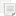

Optical Analysis of Photonic-Crystal VCSEL
------------------------------------------

Analyzed structure
^^^^^^^^^^^^^^^^^^

All the previous tutorials dealed with two-dimensional geometry. Here we will define a three-dimensional structure and perform its optical analysis. This tutorial is base on the article ‘Numerical Methods for modeling Photonic-Crystal VCSELs’ [Dems-2010]_, which compares several advanced method for analysis of a PC-VCSEL.

Photonic crystal etched in the VCSEL structre breaks its axial symmetry, and, hence, the two-dimensional cylindirical approximation cannot be used any more. Furthermore, strong refractive index contrast between semiconductor layers and photonic crystal pattern causes strong light scattering and a typical linear polarization (LP) approximation is no longer valid. In consequence, application of popular simplified models is impossible, especially in situations where one needs to determine not only the resonant wavelength of the PC-VCSEL cavity, but also the cavity Q-factor or the gain characteristics of the laser.

.. _fig-tutorial5-pc-vcsel:
.. figure:: tutorial5-pc-vcsel.*
   :scale: 120%
   :align: center

   Schematic structure of PC-VCSEL modelled in :file:`tutorial5.xpl` file.

The structure for this tutorial is a gallium arsenide PC-VCSEL presented in the figure :ref:`schematic structure of PC-VCSEL <fig-tutorial5-pc-vcsel>`. It consists of single-wavelength long GaAs cavity, sandwiched by 24/29 pairs of top/bottom GaAs/AlGaAs distributed Bragg reflectors (DBRs). The optical gain is provided by three layers of 8 nm-thick InGaAs quantum wells separated by 5 nm GaAs barriers and located together in the anti-node position. The diameter of the optical gain region is set to be the same as the photonic crystal pitch Λ. Details for layer thickness and refractive index values can be found in the table below:

+--------+---------------------+----------------+------------------+
| Layer                        | Thickness [nm] | Refractive index |
+========+=====================+================+==================+
|        | Top DBR             | 69.40          | 3.53             |
|        |                     |                |                  |
|        | 24 pairs            | 79.55          | 3.08             |
+--------+---------------------+----------------+------------------+
|        |                     | 121.71         | 3.53             |
+        +---------------------+----------------+------------------+
| Cavity | Multi quantum wells | 3×8.00 / 2×5.00| 3.56 / 3.35      |
+        +---------------------+----------------+------------------+
|        |                     | 121.71         | 3.53             |
+--------+---------------------+----------------+------------------+
|        | Bottom DBR          | 79.55          | 3.08             |
|        |                     |                |                  |
|        | 29 pairs            | 69.40          | 3.53             |
+--------+---------------------+----------------+------------------+
|        | Substrate           | infinite       | 3.53             |
+--------+---------------------+----------------+------------------+

In the quantum wells the imaginary part of the refractive index is *n*\ :sub:`g` for *r* ≤ *Λ* and –0.01 for *r* > *Λ*.

The photonic crystal is etched in the structure and consists of three rings of a triangular lattice with one missing hole in the center. In the analysis the holes are etched from the top edge of the laser structure down to the specified number of DBR pairs.

Epitaxial layers
~~~~~~~~~~~~~~~~

Defining epitaxial layers is very similar to the previous tutorials. However, this time we operate in 3D, which means we will have sligtly different geometrical objects and we will need to specify three coordinates or dimensions instead of two.

Before you begin defining the geometry, open new PLaSK window and switch to the *Defines* tab, and define the following parameters:

======= ====================
Name    Value
======= ====================
L       4.0
aprt    L
d       0.5
totalx  (6.1*sqrt(3)/2+d)*L
totaly  (6.1+d)*L
etched  24
======= ====================

We will use these values in our geometry. Their meaning is as follows: *L* is the photonic crystal pitch, *R* is the radius of the gain aperture, *d* is the relative diameter of etched holes, *totalx* and *totaly* are dimensions of the whole computational region, and *etched* is the number of etched DBR pairs.

Next, switch to the *Materials* tab and add three materials. For each of them add property ``Nr`` in the right table and set the materials names and `Nr` values as follows:

================= ============
Material ``Name`` ``Nr`` value
================= ============
GaAs              3.53
AlGaAs            3.08
QW                3.56 - 0.01j
================= ============

Now you may switch back to the *Geometry* tab. Press |list-add| and select ``Cartesian3D`` from the list. It will create three-dimensional geometry (:xml:tag:`cartesian3d`). In the bottom left of the window, set a name ``main`` for the geometry, and type ``GaAs`` in the ‘Bottom’ field of the Border Settings (bottom-left one). Next, press |list-add| again, select ``Item`` submenu and choose ``Stack``. Select the new stack in the geometry tree and add another stack. Set its name to ``bottom-dbr`` and ‘Repeat’ value to ``29``. Inside add a ``Cuboid`` object, set its ‘Size’ to ``{totalx}`` × ``{totaly}`` × ``0.06940`` and the material to ``GaAs``. Now, right-click on the Cuboid node in the geometry tree and select ``Duplicate`` from the pop-up menu. You can notice that a copy of the cuboid appeared just above the first one. Select it and change the last `Size` value (height) to ``0.07955`` and the material to ``AlGaAs``. Now you should see the multi-layered DBR stack (you may need to select the geometry and click |applications-graphics| above the preview area).

Having the bottom DBR defined, we need to add top DBR and the cavity. The simples way to create the top DBR stack is to clone the bottom one (use righ-click menu, or press |edit-copy| on the toolbar). However, if you do it, you will notice that the order of the layers in the top DBR is wrong (GaAs layer should be on top): select the GaAs layer and press |go-up| button on the toolbar, to correct it. Next, select the top DBR stack, set its name to ``top-dbr`` and change the ‘Repeat’ value to 24.

We need to add another stack for a cavity. Select the topmost stack, press |list-add| to add another ``Stack``. Next, press |go-down| to locate the cavity stack (empty for now) between the DBRs. Now add cavity layers according to the table above.

When adding the quantum well layers, we need to define the gain aperture. Do to this, we first add the ``Align`` container and specify default item position as ‘Longitudinal’ ``center`` at 0, ‘Transverse’ ``center`` at 0, and ‘Vertical’ ``bottom`` at 0. In this container, we can place objects one over another and the objects lower in the tree overwrite the previous one. Hence, inside the Align, we add a cuboid of size ``{totalx}``\ ×\ ``{totaly}``\ ×\ ``0.00800`` and material ``QW`` and next we add a cylinder of  ‘Radius’ ``{R}`` and ‘Height’ ``0.00800``. For the cylinder set the material ``QW`` and in the ‘Roles’ type ``gain``. This way you have added a uniuform layer of the *QW* material, but the gain will be specified only inside the cylinder. Because you need to set such regions three times, you can add a name ``qw`` to the Align container and use ``[Repeat object]`` twice more in the cavity.

When you finish defining all the layers, press F4 and check if the source code of your geometry specification looks similar to the following:

.. code-block:: xml

   <cartesian3d name="vcsel" axes="x,y,z" back="mirror" front="extend"
                left="mirror" right="extend" bottom="GaAs">
     <stack>
       <stack name="top-dbr" repeat="24">
         <cuboid material="GaAs" dx="{totalx}" dy="{totaly}" dz="0.06940"/>
         <cuboid material="AlGaAs" dx="{totalx}" dy="{totaly}" dz="0.07955"/>
       </stack>
       <stack name="cavity">
         <cuboid material="GaAs" dx="{totalx}" dy="{totaly}" dz="0.12171"/>
         <align name="qw" xcenter="0" ycenter="0" bottom="0">
           <cuboid material="QW" dx="{totalx}" dy="{totaly}" dz="0.00800"/>
           <cylinder name="gain" role="gain" material="QW" radius="{R}"
                     height="0.00800"/>
         </align>
          <cuboid name="interface" material="GaAs" dx="{totalx}" dy="{totaly}" 
                  dz="0.00500"/>
         <again ref="qw"/>
         <cuboid material="GaAs" dx="{totalx}" dy="{totaly}" dz="0.00500"/>
         <again ref="qw"/>
         <cuboid material="GaAs" dx="{totalx}" dy="{totaly}" dz="0.12171"/>
       </stack>
       <stack name="bottom-dbr" repeat="29">
         <cuboid material="AlGaAs" dx="{totalx}" dy="{totaly}" dz="0.07955"/>
         <cuboid material="GaAs" dx="{totalx}" dy="{totaly}" dz="0.06940"/>
       </stack>
     </stack>
   </cartesian3d>

In the code above, we have added a name ``interface`` to one of the barriers in the cavity, as it will be helpful later when we define an optical solver.

.. [Dems-2010]
   M. Dems, I.-S. Chung, P. Nyakas, S. Bischoff, K. Panajotov,
   ‘Numerical Methods for Modeling Photonic-Crystal VCSELs,’
   Opt. Express 18 (2010), pp. 16042-16054

   

.. |applications-graphics| image:: applications-graphics.png
   :align: middle
   :alt: +

